# finnalTest

## 这次任务我采用了vue+node前后端分离开发

具体来说技术栈是vue+axios+vue-cli3.0，koa2+puppeteer

## 具体步骤
1. 利用puppeteer抓取qq音乐主页上的数据，想学习新的东西就没采用它的接口
2. 把数据存入本地，一开始存入的mongodb，后来外网速度过慢，为了测试方便，直接存入了本地json
3. 开启服务，开放接口
4. 分析qq音乐网站组成，分离为组件，然后开发
5. 封装api，设置跨域
6. 代入数据进行测试
7. 进行vue多页面开发
8. 写了两个子页面，注册页面和我的音乐页面

## 目录结构
### 前端
```
|-- qq-music
    |-- .browserslistrc
    |-- .eslintrc.js
    |-- .gitignore
    |-- babel.config.js
    |-- debug.log
    |-- package.json
    |-- postcss.config.js
    |-- README.md
    |-- vue.config.js
    |-- yarn.lock
    |-- data
    |   |-- main.json
    |   |-- search.json
    |   |-- songList.json
    |-- public
    |   |-- favicon.ico
    |   |-- index.html
    |   |-- login.html
    |   |-- myMusic.html
    |-- src
        |-- App.vue
        |-- main.js
        |-- router.js
        |-- store.js
        |-- assets
        |   |-- image
        |       |-- bg_detail.jpg
        |       |-- bg_index_top.jpg
        |       |-- cover_play@2x.png
        |       |-- error@2x.png
        |       |-- footer@2x.png
        |       |-- green@2x.png
        |       |-- icon_3_tiny.png
        |       |-- icon_popup@2x.png
        |       |-- icon_sprite@2x.png
        |       |-- index_tit@2x.png
        |       |-- info@2x.png
        |       |-- load.gif
        |       |-- login1.jpg
        |       |-- logo.png
        |       |-- logo3.png
        |       |-- logo@2x.png
        |       |-- sprite_privilege.png
        |       |-- sprite_privilege@2x.png
        |-- components
        |   |-- common
        |   |   |-- btn.vue
        |   |   |-- GeeenDiamond.vue
        |   |   |-- Money.vue
        |   |   |-- point.vue
        |   |   |-- SideBar.vue
        |   |   |-- TopFunction.vue
        |   |   |-- TopLogin.vue
        |   |   |-- TopSearch.vue
        |   |   |-- TopUserF.vue
        |   |   |-- videoBtn.vue
        |   |   |-- WarnMsg.vue
        |   |-- content
        |   |   |-- AwesomeRecommend.vue
        |   |   |-- Content.vue
        |   |   |-- LeaderBoard.vue
        |   |   |-- MV.vue
        |   |   |-- NewDish.vue
        |   |   |-- NewSong.vue
        |   |   |-- SongRecommend.vue
        |   |-- footer
        |   |   |-- Footer.vue
        |   |-- header
        |       |-- Header.vue
        |       |-- pageNav
        |       |   |-- PageNav.vue
        |       |-- topNav
        |           |-- TopNav.vue
        |-- pages
        |   |-- login
        |   |   |-- login.js
        |   |   |-- login.vue
        |   |-- myMusic
        |       |-- MyArea.vue
        |       |-- myMusic.js
        |       |-- myMusic.vue
        |-- request
        |   |-- api.js
        |   |-- configUrl.js
        |   |-- http.js
        |-- views

```
### 后端
```
|-- qq-music-server
    |-- .babelrc
    |-- index.js
    |-- package.json
    |-- yarn.lock
    |-- models
    |   |-- User.js
    |-- src
        |-- server.js
        |-- config
        |   |-- connect.js
        |   |-- mongoURI.js
        |-- data
        |   |-- awesomeRecommend.json
        |   |-- data.js
        |   |-- hotKey.json
        |   |-- leaderBoard.json
        |   |-- mv.json
        |   |-- newDish.json
        |   |-- newSong.json
        |   |-- qqMusic.js
        |   |-- songRecommend.json
        |   |-- test.json
        |-- routes
            |-- qqUrl.js
            |-- songList.js
            |-- users.js

```

## 图片展示

```
后台部分展示
```
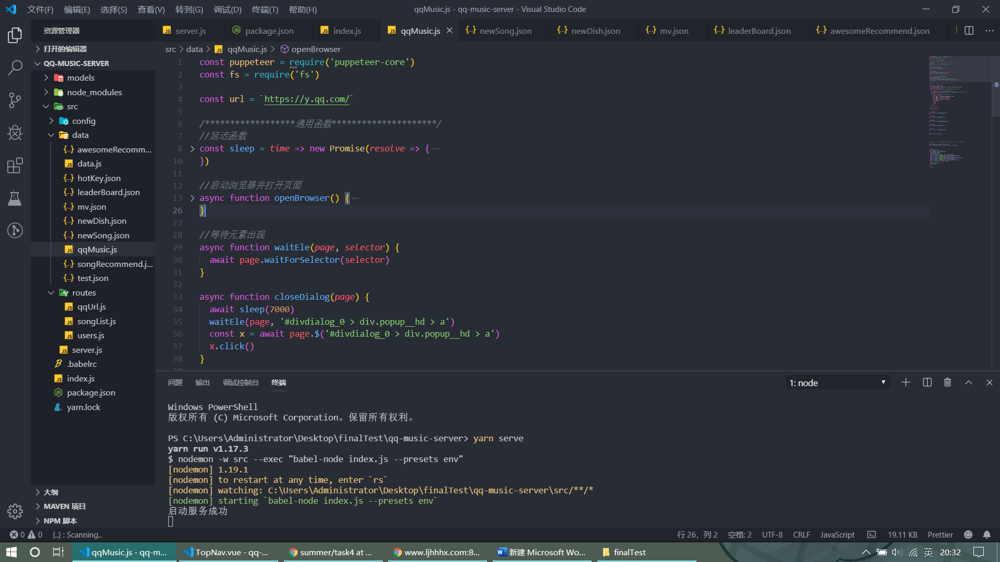
```
前端部分展示
```
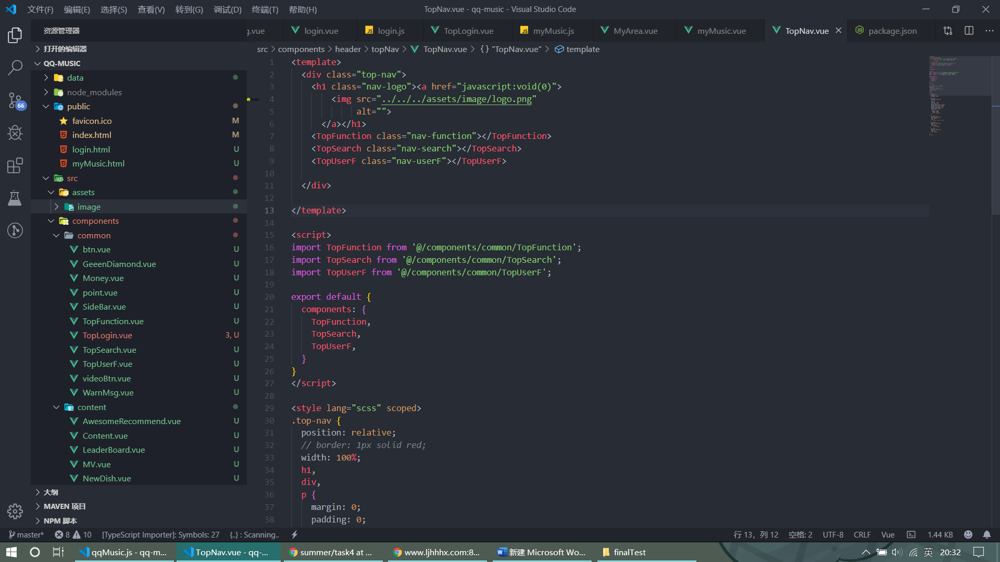

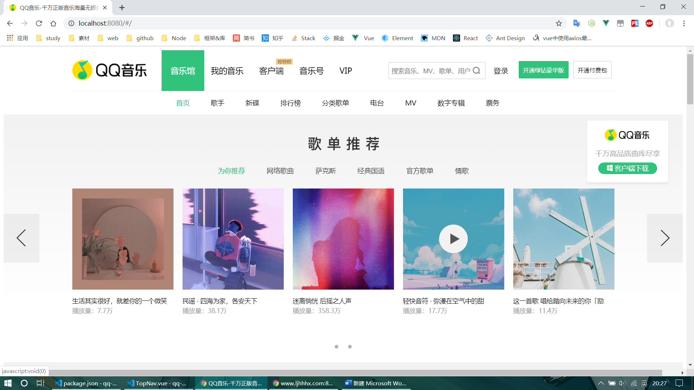
```
做了搜索栏的数据和操作
```
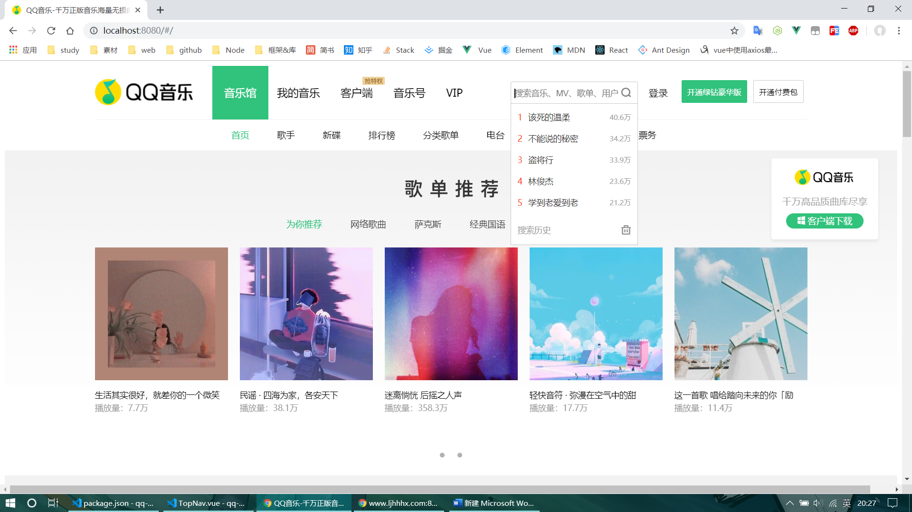
```
做了左右按钮，包括动画和动作
```
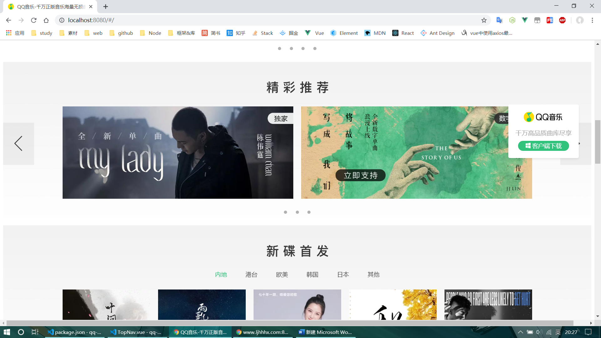
```
做了鼠标移上去会出现播放按钮的组件
```
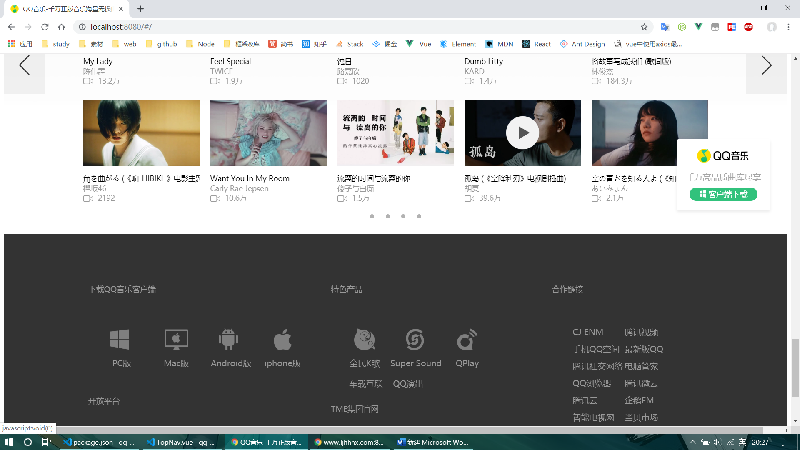
```
登录界面
```
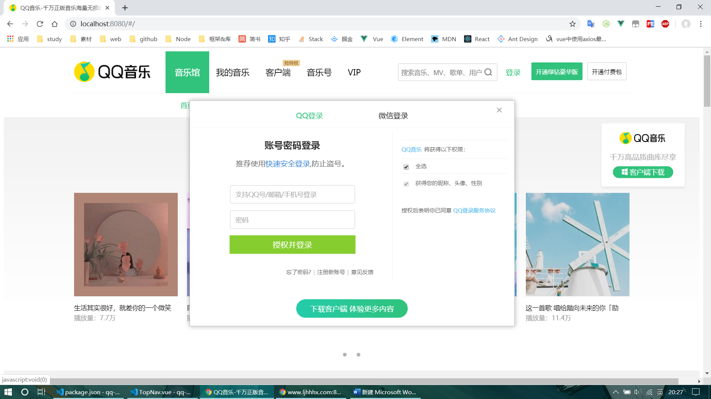
```
做了失败弹窗组件
```
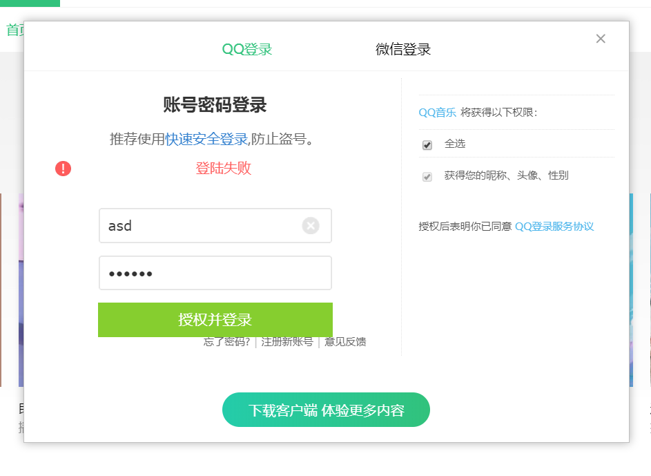
```
注册界面
```
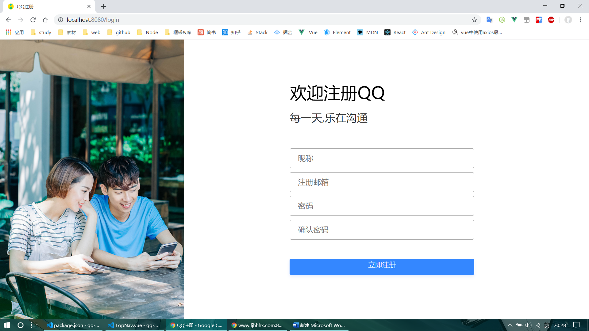
```
做了注册验证，具体采用的是正则表达式
```
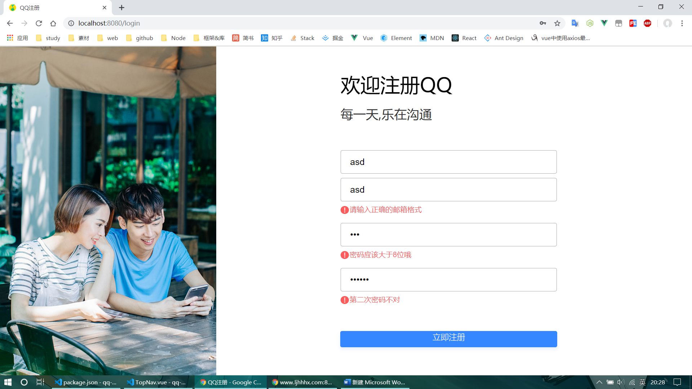
```
注册失败展示
```
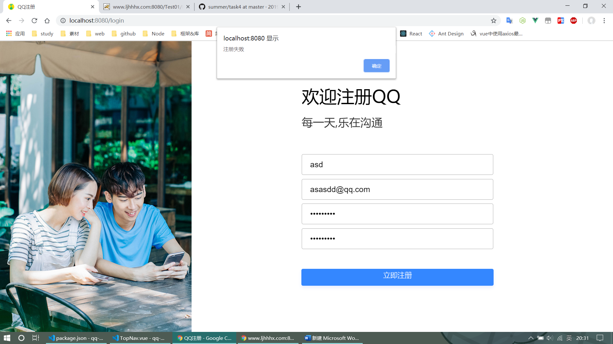

### 之前做了b站，搞得组件太多，组件之间的通信关系有些混乱就放弃了，所以qq音乐这个也是赶工做出来的，还望见谅
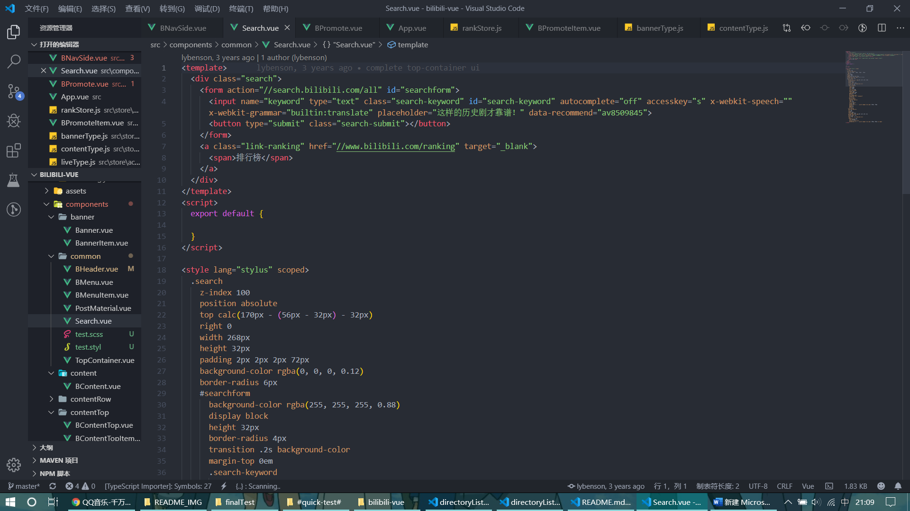

