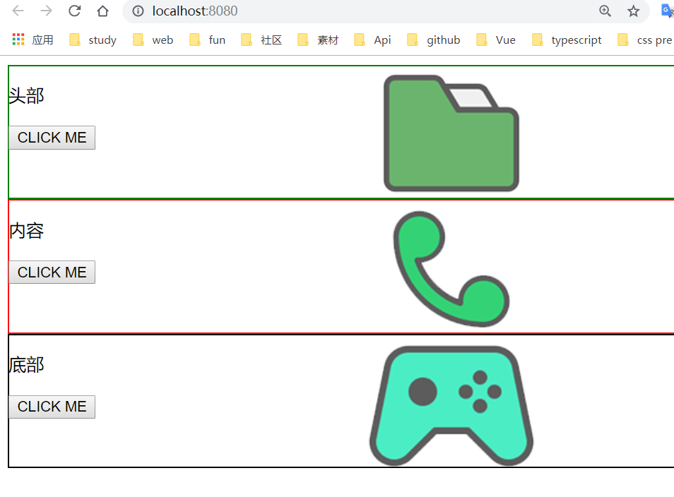
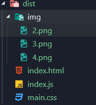

## 目录结构
```
|-- task5
    |-- .gitignore
    |-- index.html
    |-- package-lock.json
    |-- package.json
    |-- README.md
    |-- webpack.config.js
    |-- dist
    |   |-- index.html
    |   |-- index.js
    |   |-- main.css
    |   |-- img
    |       |-- 2.png
    |       |-- 3.png
    |       |-- 4.png
    |-- test
        |-- img
        |   |-- 2.png
        |   |-- 3.png
        |   |-- 4.png
        |-- js
        |   |-- footer.js
        |   |-- header.js
        |   |-- index.js
        |   |-- main.js
        |-- style
            |-- footer.less
            |-- header.less
            |-- main.less
```

## 截图说明
### 热更新
```
安装webpack-dev-server，并在package.json中配置
 "scripts": {
    "start": "webpack-dev-server"
  },
npm run start实现热更新
修改代码可直接渲染到页面中
```



### 打包
```
配置webpack.config.js,设置为development
在终端输入webpack打包到dist文件夹下
```



