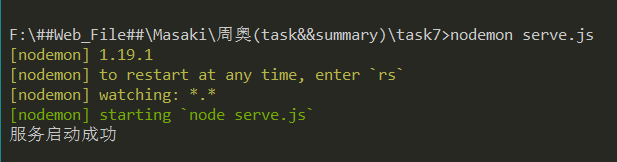
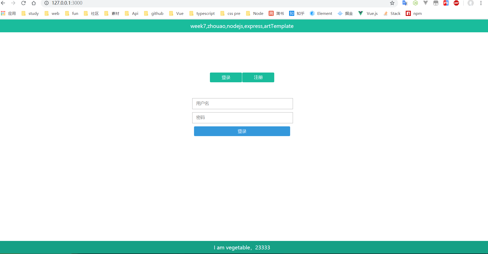
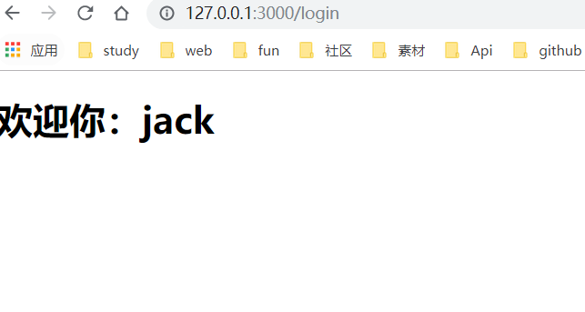
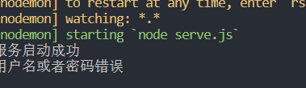
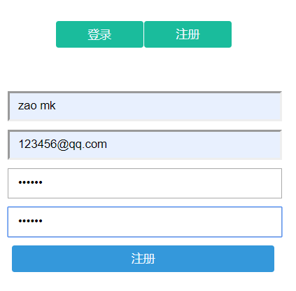

## task7
### 目录结构
```
|-- task7
    |-- db.json
    |-- login.js
    |-- package-lock.json
    |-- package.json
    |-- README.md
    |-- router.js
    |-- serve.js
    |-- public
    |   |-- js
    |   |   |-- main.js
    |   |-- style
    |       |-- main.css
    |-- README_IMG
    |-- views
        |-- 404.html
        |-- index.html
        |-- login
            |-- loginMsg.html

```

### 项目启动
使用`nodemon`启动node
```shell
nodemon serve.js
```
监听端口`3000`
```javascript
app.listen(3000, () => {
  console.log('服务启动成功');
});
```



### 项目展示



1. 登录成功,用模板引擎渲染得到loginMsg.html

   

2. 登录失败,后台反馈

   
   
3. 注册

   

   
